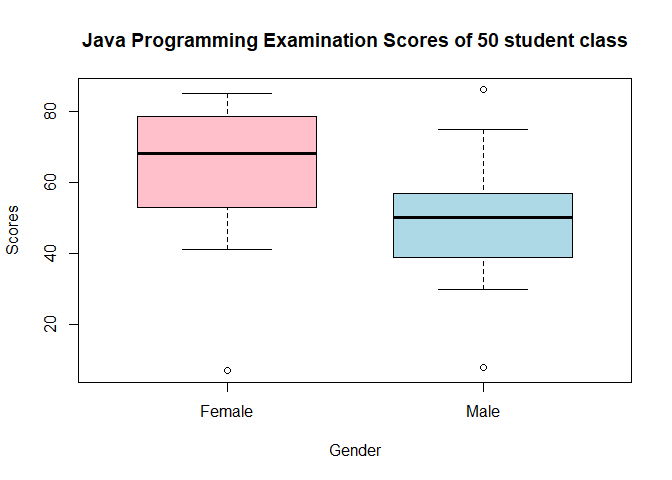

RODILLAS, CHRISTIAN MIGUEL T. FA 1
================
2024-02-01

``` r
#1. find the skewness
Results <- read.csv("E:/Downloads/Results.csv") #please adjust depending on the file name and location
View(Results)


#get all the means 
arch1_mean <- mean(Results$arch1, na.rm = TRUE)
prog1_mean <- mean(Results$prog1, na.rm = TRUE)
arch2_mean <- mean(Results$arch2, na.rm = TRUE)
prog2_mean <- mean(Results$prog2, na.rm = TRUE)

#get all the median
arch1_median <- median(Results$arch1, na.rm = TRUE)
prog1_median <- median(Results$prog1, na.rm = TRUE)
arch2_median <- median(Results$arch2, na.rm = TRUE)
prog2_median <- median(Results$prog2, na.rm = TRUE)

#get all the standard deviation
arch1_sd <- sd(Results$arch1, na.rm = TRUE)
prog1_sd <- sd(Results$prog1, na.rm = TRUE)
arch2_sd <- sd(Results$arch2, na.rm = TRUE)
prog2_sd <- sd(Results$prog2, na.rm = TRUE)

#get all their skewness using the formula 

arch1_skew <- (3*(arch1_mean - arch1_median))/arch1_sd
print(paste0("The value of skewness for prog2 is ", arch1_skew))
```

    ## [1] "The value of skewness for prog2 is -0.606904206669057"

``` r
prog1_skew <- (3*(prog1_mean - prog1_median))/prog1_sd
print(paste0("The value of skewness for prog1 is ", prog1_skew))
```

    ## [1] "The value of skewness for prog1 is -0.643228962747166"

``` r
arch2_skew <- (3*(arch2_mean - arch2_median))/arch2_sd
print(paste0("The value of skewness for arch2 is ", arch2_skew))
```

    ## [1] "The value of skewness for arch2 is 0.542128564908418"

``` r
prog2_skew <- (3*(prog2_mean - prog2_median))/prog2_sd
print(paste0("The value of skewness for prog2 is ", prog2_skew))
```

    ## [1] "The value of skewness for prog2 is -0.356290812560432"

``` r
#as an alternative, this is when using packages

library(moments)
print("Next, this is using library package")
```

    ## [1] "Next, this is using library package"

``` r
arch1_skewpack <- skewness(Results$arch1, na.rm = TRUE)
print(paste0("Using the package, the value of skewness for arch1 is ", arch1_skewpack))
```

    ## [1] "Using the package, the value of skewness for arch1 is -0.512946249306507"

``` r
prog1_skewpack <- skewness(Results$prog1, na.rm = TRUE)
(paste0("Using the package, the value of skewness for prog1 is ", prog1_skewpack))
```

    ## [1] "Using the package, the value of skewness for prog1 is -0.333426526864521"

``` r
arch2_skewpack <- skewness(Results$arch2, na.rm = TRUE)
(paste0("Using the package, the value of skewness for arch2 is ", arch2_skewpack))
```

    ## [1] "Using the package, the value of skewness for arch2 is 0.448160046465879"

``` r
prog2_skewpack <- skewness(Results$prog2, na.rm = TRUE)
(paste0("Using the package, the value of skewness for prog2 is ", prog2_skewpack))
```

    ## [1] "Using the package, the value of skewness for prog2 is -0.301826930004153"

1.  answer: The two programs above shows 2 different ways to provide a
    skewness through the use of R. one is through packages and another
    is through formula given. This comparison shows the discrepancy of
    skewness values using formula and using packages. It is much more
    efficient to use the packages available in Rstudio since it provides
    a more accurate interpretation of data, while being less time
    consuming. On the case of its approximation, the R provides an
    acceptable range of skewness values that showcases the distribution
    of the scores of the students. With negative values indicating that
    it is left-skewed distribution, which in this case, shows that more
    students in arch1, prog1, and prog2 have more people with higher
    grades. Vice versa, arch2 shows that it has a right-skewed
    distribution, meaning more students are on the lower side. Skewness
    is a reasonable data to show various tendencies of a data, in this
    case, in the marks of the class.

``` r
#2.  For the class of 50 students

#(a)
#creating a vector for each gender and displaying stem and leaf plot

class_females <- c(57, 59, 78, 79, 60, 65, 68, 71, 75, 48, 51, 55, 56, 41, 43, 44, 75, 78, 80, 81, 83, 83, 85)
class_males <- c(48, 49, 49, 30, 30, 31, 32, 35, 37, 41, 86, 42, 51, 53, 56,42, 44, 50, 51, 65, 67, 51, 56, 58, 64, 64, 75)

stem(class_females)
```

    ## 
    ##   The decimal point is 1 digit(s) to the right of the |
    ## 
    ##  4 | 1348
    ##  5 | 15679
    ##  6 | 058
    ##  7 | 155889
    ##  8 | 01335

``` r
stem(class_males)
```

    ## 
    ##   The decimal point is 1 digit(s) to the right of the |
    ##
    ##   3 | 001257
    ##   4 | 122499
    ##   5 | 01113668
    ##   6 | 4457
    ##   7 | 5
    ##   8 | 6

2.a answer:leaf and stem plots provide an alternative way to visualize data
distribution, specially numerical, and have some advantages for it.
First, it shows with ease of representation due to its minimalist nature
and simplicity. It also provides a graphical data in an ordered manner
while retaining its original data, and in return, shows major digits of
the value, making it easier to identify patterns and trend. With regards to
the value, the distribution of grades of the female are secluded within the 40s
to 80s marks, with the 70s score having the highest concentration. In accordance, 
the scores of the male are more spread out from 30s to 80s, with most of them are 
within the 50s grade, meaning the female acquired a relatively higher marks than
the male

``` r
#(b) boxplot and discuss the findings

class_females <- c(7, 59, 78, 79, 60, 65, 68, 71, 75, 48, 51, 55, 56, 41, 43, 44, 75, 78, 80, 81, 83, 83, 85)
class_males <- c(8, 49, 49, 30, 30, 31, 32, 35, 37, 41, 86, 42, 51, 53, 56,42, 44, 50, 51, 65, 67, 51, 56, 58, 64, 64, 75)
data_list <- list(Female = class_females, Male = class_males)
boxplot(data_list, main = "Java Programming Examination Scores of 50 student class", col = c("pink", "lightblue"), xlab="Gender", ylab="Scores", border="black", boxwex = 0.7)
```

<!-- -->


#2.b answer: The boxplot is an effective way of communicating data that is more easier for interpretation and less of a hassle for people who are not aware of the numerized data. Through the used of boxplot, a graphical representation of the JAVA examination scores were provided which shows the grade distribution between male and female groups of the class. According to the graph, the female perfomed better with higher grade distribution and mean than the male. Among the female, the average score obtained were around the mark of 70, whilst the male had a lower grade distribution. with a mean grade of around 50. It is also worth to mention that the upper quartile of the male is comparable to the lower quartile of the female. In conclusion, for the programming examination, the female performed on a higher quality compared to the male group. 
