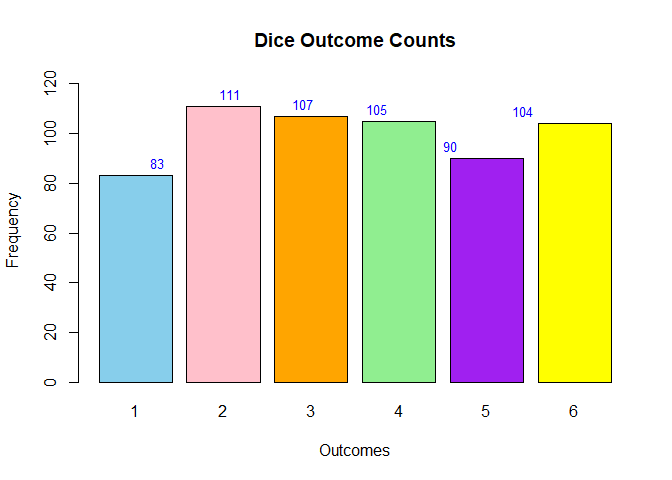

FA2_Rodillas
================
2024-02-18

2.  An experiment consists of tossing two fair coins. Use R to simulate
    this experiment 100 times and obtain the relative frequency of each
    possible outcome. Hence, estimate the probability of getting one
    head and one tail in any order.

``` r
a <- sample(c("HH", "TT", "HT", "TH"), 100, replace = TRUE)
outcome_coin <- table(a)
two_heads = outcome_coin["HH"]
two_tails = outcome_coin["TT"]
one_each = outcome_coin["HT"] + outcome_coin["TH"]

side_list <- list("Two heads" = two_heads, "Two tails" = two_tails, "One each" = one_each)
barplot(unlist(side_list), col = c("gray", "gray", "lightblue"), main = "Highlighted Probability of Getting Two Unique Coin Side", xlab = "Outcomes", ylab = "Probability", ylim = c(0, max(unlist(side_list)) * 1.1))


text(x = which(names(side_list) == "One each"), y = side_list[["One each"]], labels = round(side_list[["One each"]], 2), pos = 3, cex = 0.8, col = "black")
```

<!-- -->
Experiment Result: Relative Frequency HH 27 TT 20 HT 53 This shows the
probability of getting exactly one head and one tail, regardless of
their position. It is considerably larger probability compared to the
two since it combines the probability of the sets {TH,HT}

Therefore, based on the experiment, the probability of getting one each
is 53%

3.  An experiment consists of rolling a die. Use R to simulate this
    experiment 600 times and obtain the relative frequency of each
    possible outcome. Hence, estimate the probability of getting each of
    1, 2, 3, 4, 5, and 6.

``` r
b <- sample(c(1, 2, 3, 4, 5, 6), 600, replace = TRUE)
outcome_counts <- table(b)
one_count <- outcome_counts[1]
two_count <- outcome_counts[2]
three_count <- outcome_counts[3]
four_count <- outcome_counts[4]
five_count <- outcome_counts[5]
six_count <- outcome_counts[6]


count_list <- c(one_count, two_count, three_count, four_count, five_count, six_count)

barplot(count_list, col = c("skyblue", "pink", "orange" , "lightgreen" , "purple" , "yellow"),  main = "Dice Outcome Counts", xlab = "Outcomes", ylab = "Frequency", ylim = c(0, max(count_list) * 1.1)) 

text(x = 1:6, y = count_list + 5, label = count_list, pos = , col = "blue", cex = 0.8)
```

<!-- -->
Result:

The figure above shows the relative frequency of obtaining each side of
a fair dice after 600 rolls. Using the formula to obtain the
probability, the estimated probability of each side are as follows: 1 =
.14 or 14% 2 = .185 or 18.5% 3 = .178 or 17.8% 4 = .175 or 17.5% 5 = .15 or
15% 6 = .17 or 17%
