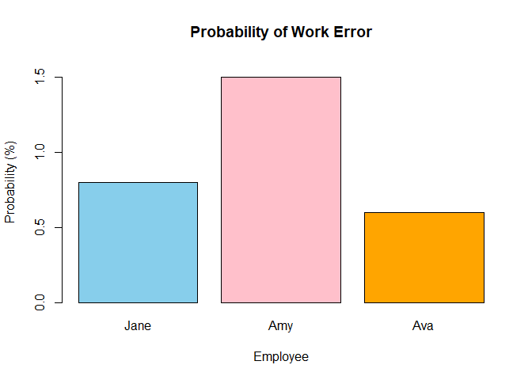

FA3
================
2024-02-25

2.  a.)a 1 was received

Using law of total possibility, we can calculate the probability of
receiving a one after message is trasmitted as 0, and add to the
probability of receiving a correct 1 after transmitting a 1.

``` r
transmit_correct_0 <- 0.95 
transmit_correct_1 <- 0.75
transmitted_0 <- 0.70
transmitted_1 <- 1 - transmitted_0


received_1 <- (transmitted_0 * (1 - transmit_correct_0)) + (transmitted_1 * transmit_correct_1)
cat("The probability that a 1 was received is ", received_1 *100, "%")
```

    ## The probability that a 1 was received is  26 %

2.b.) a 1 was transmitted given than a 1 was received using Bayes
Theory,

``` r
transmit_1_where_1_received <- (transmitted_1 * transmit_correct_1)/ received_1
cat("The probability that a 1 was transmitted after a 1 was received is ", transmit_1_where_1_received * 100, "%")
```

    ## The probability that a 1 was transmitted after a 1 was received is  86.53846 %

7.  employees in an IT company

For the overall percentage of error:

``` r
#this is their work contribs
work_jane <- 0.10
work_amy <- 0.30
work_ava <- 0.60
#this is their work error
error_jane <- 0.08
error_amy <- 0.05
error_ava <- 0.01

#a. overall percentage of error

overall_error <- (work_jane * error_jane) + (work_amy * error_amy) + (work_ava * error_ava)
cat("Overall percentage of error is ", overall_error *100,"%")
```

    ## Overall percentage of error is  2.9 %

To find out who is the most likely to have written the error code,

``` r
#b. which has higest probability of writing the wrong 

percentage_rate_error <- c(Jane = work_jane * error_jane* 100, Amy = work_amy * error_amy* 100, Ava = work_ava * error_ava* 100)
most_likely_written_error <- which.max(percentage_rate_error)

cat("The most likely person who has written the error is", most_likely_written_error, "with an error rate of", percentage_rate_error[most_likely_written_error], "%")
```

    ## The most likely person who has written the error is 2 with an error rate of 1.5 %

For easier visualization:

``` r
#to visualize, 
barplot(percentage_rate_error, col = c("skyblue", "pink", "orange"), ylim = c(0, 1.6), main = "Probability of Work Error", xlab = "Employee", ylab = "Probability (%)")
```

<!-- -->

Amy is the most likely to have written the error code at 1.5%
