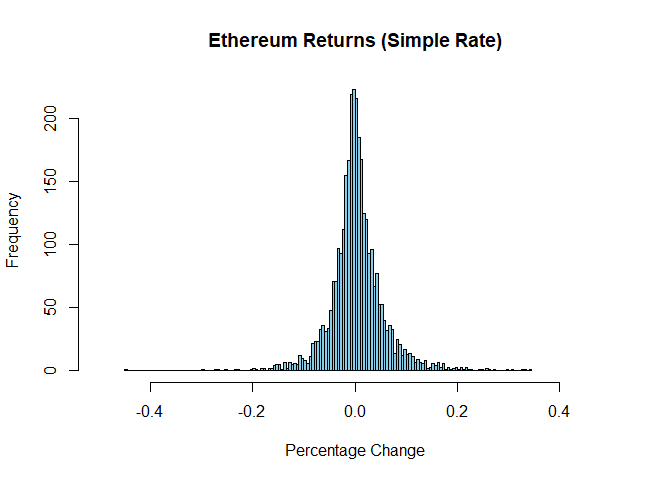
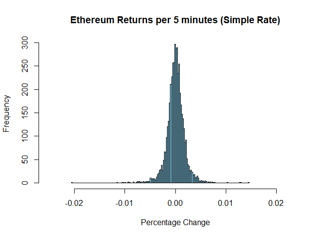

SA2_Afundar_Rodillas
================
2024-05-12

## Find out which probability distribution function best fits Bitcoin’s returns for trading data every minute, from January 1, 2012 to April 15, 2024, for Bitcoin quoted in United States dollars or the BTC/USD pair.

Due to the lack of data for 1 minute bitcoin returns, we decided to use
a 1 day bitcoin return so it still fits the date of 2012 - 2024.

Firstly, check if the data is being read properly by checking head and
tail:

``` r
head(df)
```

    ##         Date     Price      Open      High       Low    Vol. Change  X
    ## 1 04/15/2024 63,411.90 65,696.60 66,805.10 62,379.50 118.79K -3.48% NA
    ## 2 04/14/2024 65,697.40 63,909.50 65,758.20 62,174.70 134.40K  2.89% NA
    ## 3 04/13/2024 63,849.90 67,137.40 67,921.00 61,065.50 149.48K -4.92% NA
    ## 4 04/12/2024 67,151.90 70,014.90 71,226.90 65,829.30 131.84K -4.08% NA
    ## 5 04/11/2024 70,011.60 70,620.40 71,249.20 69,586.10  72.51K -0.86% NA
    ## 6 04/10/2024 70,622.10 69,147.80 71,086.90 67,570.00  97.71K  2.13% NA
    ##            X.1       X.2
    ## 1                       
    ## 2          Bin Frequency
    ## 3      -0.5721         1
    ## 4 -0.513286567         0
    ## 5 -0.454473134         0
    ## 6 -0.395659701         1

``` r
tail(df)
```

    ##            Date Price Open High Low    Vol. Change  X X.1 X.2
    ## 4484 01/06/2012   6.7  6.9  7.2 6.1 218.08K -3.60% NA        
    ## 4485 01/05/2012   6.9  5.6  7.2 5.6 182.33K 24.78% NA        
    ## 4486 01/04/2012   5.6  4.9  5.7 4.8 131.17K 14.14% NA        
    ## 4487 01/03/2012   4.9  5.2  5.3 4.7 125.17K -6.51% NA        
    ## 4488 01/02/2012   5.2  5.3  5.5 4.8  69.15K -0.95% NA        
    ## 4489 01/01/2012   5.3  4.7  5.5 4.6 108.51K 11.65% NA

## Histogram of returns

``` r
df$Change <- as.numeric(gsub("%", "", df$Change)) / 100

x_limits <- c(-0.3, 0.3)

hist(df$Change, main = "Histogram of returns", xlab = "returns", ylab = "Frequency", col = "lightblue", breaks = 500, xlim = x_limits)
```

<!-- -->

With this, find the closest fit to the return by using the
Kolmogorv-Smirnov Test. Doing this, the smallest KS test would be the
best fit in the histogram.

There will be 4 distribution test that we would try: Normal, Laplace,
Student (T), and Tsallis.

## Normal Distribution KS Test

``` r
ks_result_normal <- ks.test(df$Change, "pnorm", mean = mean(df$Change), sd = sd(df$Change))
```

    ## Warning in ks.test.default(df$Change, "pnorm", mean = mean(df$Change), sd =
    ## sd(df$Change)): ties should not be present for the Kolmogorov-Smirnov test

``` r
print(ks_result_normal)
```

    ## 
    ##  Asymptotic one-sample Kolmogorov-Smirnov test
    ## 
    ## data:  df$Change
    ## D = 0.19277, p-value < 2.2e-16
    ## alternative hypothesis: two-sided

## Laplace Distribution KS Test

``` r
laplace_pdf <- function(x, mu, b) {
  exp(-abs(x - mu) / b) / (2 * b)
}

laplace_cdf <- function(x, mu, b) {
  integrate(laplace_pdf, lower = -Inf, upper = x, mu = mu, b = b)$value
}

laplace_cdf_data <- sapply(df$Change, function(x) laplace_cdf(x, mu = 0, b = 0.04))

ks_result_laplace <- ks.test(laplace_cdf_data, punif)
```

    ## Warning in ks.test.default(laplace_cdf_data, punif): ties should not be present
    ## for the Kolmogorov-Smirnov test

``` r
print(ks_result_laplace)
```

    ## 
    ##  Asymptotic one-sample Kolmogorov-Smirnov test
    ## 
    ## data:  laplace_cdf_data
    ## D = 0.12476, p-value < 2.2e-16
    ## alternative hypothesis: two-sided

# T Distribution KS Test

``` r
student_pdf <- function(x, df) {
  dt(x, df)
}

student_cdf <- function(x, df) {
  integrate(student_pdf, lower = -Inf, upper = x, df = df)$value
}


student_cdf_data <- sapply(df$Change, function(x) student_cdf(x, df = 5))

ks_result_student <- ks.test(student_cdf_data, punif)
```

    ## Warning in ks.test.default(student_cdf_data, punif): ties should not be present
    ## for the Kolmogorov-Smirnov test

``` r
print(ks_result_student)
```

    ## 
    ##  Asymptotic one-sample Kolmogorov-Smirnov test
    ## 
    ## data:  student_cdf_data
    ## D = 0.44557, p-value < 2.2e-16
    ## alternative hypothesis: two-sided

# Tsallis Distribution KS Test

``` r
rtsal <- function(n, q, beta) {
  u <- runif(n)
  if (q == 1) {
    return(-beta * log(1 - u))
  } else {
    return(sign(q) * beta * (1 - (1 + q * beta * u)^(1/q)))
  }
}
df_test<- rtsal(length(na.omit(df$Change)), mean(na.omit(df$Change)), sd(na.omit(df$Change)))
jittered_data <- jitter(na.omit(df$Change))
ks_result <- ks.test(jittered_data, df_test)
print(ks_result)
```

    ## 
    ##  Asymptotic two-sample Kolmogorov-Smirnov test
    ## 
    ## data:  jittered_data and df_test
    ## D = 0.52996, p-value < 2.2e-16
    ## alternative hypothesis: two-sided

With this, the lowest KS test among the 4 distribution is the Laplace
Distribution, and the second one being the Normal Distribution

To graph the 2 closest one, we did a pseudo theoretical distribution of
the both distribution, to produce a presentable graph.

``` r
hist(df$Change, main = "Histogram of returns", xlab = "returns", ylab = "Frequency", col = "lightblue", breaks = 500, xlim = x_limits)

shifted_laplace_pdf <- function(x) {
  laplace_pdf(x, mu = 0, b = 0.04) * length(df$Change) * diff(range(df$Change)) / 250
}

curve(shifted_laplace_pdf(x), from = x_limits[1], to = x_limits[2], add = TRUE, col = "red", lwd = 2)

shifted_normal_pdf <- function(x) {
  dnorm((x) / 0.06) * length(df$Change) * diff(range(df$Change)) / 10
}

curve(shifted_normal_pdf(x), from = x_limits[1], to = x_limits[2], add = TRUE, col = "blue", lwd = 2)


legend("topright", legend = c("Histogram of returns", "Laplace Distribution", "Normal Distribution"), 
       col = c("lightblue", "red", "blue"), lwd = c(10, 2, 2, 2, 2), lty = c(1, 1, 1, 1, 1), cex = 0.8)
```

<!-- -->

## 2. Test using Shapiro-Wilk normality test the Ethereum returns for trading data every five minutes, from August 7, 2015 to April 15, 2024.

Due to the lack of data for 5 minute ethereum returns, we decided to use
a 1 day ETH return so it still fits the date of 2015 - 2024. We used a
representation of 5-min interval from April 21- May 6, 2024 as a
compensation.

Firstly, check if the data is being read properly by checking head and
tail:

``` r
eth_df <- read.csv("E:/Downloads/ethereum_2015.csv")
```

``` r
head(eth_df)
```

    ##        Start        End     Open     High      Low    Close      Volume
    ## 1 2024-05-09 2024-05-10 2982.443 3057.994 2962.572 3041.494 15431620439
    ## 2 2024-05-08 2024-05-09 3016.979 3039.662 2950.678 2980.292 16305526587
    ## 3 2024-05-07 2024-05-08 3073.450 3129.973 3017.590 3018.800 18009353669
    ## 4 2024-05-06 2024-05-07 3147.904 3226.243 3064.510 3070.678 14774931107
    ## 5 2024-05-05 2024-05-06 3123.186 3171.053 3083.899 3145.793 12769298228
    ## 6 2024-05-04 2024-05-05 3109.002 3167.027 3105.279 3122.955 16112788054
    ##     Market.Cap
    ## 1 360740331162
    ## 2 361327030605
    ## 3 369251753661
    ## 4 376193524070
    ## 5 376368010916
    ## 6 375675206669

``` r
tail(eth_df)
```

    ##           Start        End    Open    High     Low   Close  Volume Market.Cap
    ## 3186 2015-08-20 2015-08-21 1.25886 1.53330 1.24833 1.46545 1814742   97607238
    ## 3187 2015-08-19 2015-08-20 1.08705 1.31799 1.08705 1.25117 1780392   97285895
    ## 3188 2015-08-18 2015-08-19 1.20361 1.33116 1.09508 1.09508 1763725   88139260
    ## 3189 2015-08-17 2015-08-18 1.56603 1.58119 1.18534 1.20073 2522015   84934653
    ## 3190 2015-08-16 2015-08-17 1.68890 1.69524 1.08981 1.51268 2881363   83158087
    ## 3191 2015-08-15 2015-08-16 1.82787 1.87724 1.57098 1.69244 3879627  102829937

Since the change is not given, we use formula to calculate the return
change of open and close. We added a histogram for better visualization

``` r
eth_df$Return <- ((eth_df$Close - eth_df$Open) / eth_df$Open) 

hist(eth_df$Return, main = "Ethereum Returns (Simple Rate)", xlab = "Percentage Change", xlim = c(-0.5, 0.5), col = "skyblue", breaks = 250)
```

<!-- -->

# Shapiro-Wilk Normality Test for the 1-day interval

``` r
eth_shapiro_test <- shapiro.test(eth_df$Return)

print(eth_shapiro_test)
```

    ## 
    ##  Shapiro-Wilk normality test
    ## 
    ## data:  eth_df$Return
    ## W = 0.91294, p-value < 2.2e-16

Upon observation of the Shapiro-Wilk normality test, we reject the null
hypothesis of the Shapiro-Wilk, which in this case, tells us that
Ethereum follows a normal distribution. Since in this case, the p-value
is significantly lower, then it is a non-normal distribution

``` r
eth_df5min <- read.csv("E:/Downloads/ETH_5min_sample.csv")

#Validate the df
head(eth_df5min)
```

    ##             timestamp    open    high     low   close   volume
    ## 1 2024-04-21 00:00:00 3168.20 3169.80 3163.37 3167.86 164.1261
    ## 2 2024-04-21 00:05:00 3167.82 3170.99 3166.01 3168.02  87.3208
    ## 3 2024-04-21 00:10:00 3167.97 3169.20 3160.96 3163.33 154.5709
    ## 4 2024-04-21 00:15:00 3163.41 3164.75 3155.43 3164.09 317.9401
    ## 5 2024-04-21 00:20:00 3163.79 3166.50 3161.16 3165.80 119.7915
    ## 6 2024-04-21 00:25:00 3165.38 3167.69 3162.70 3164.47  63.9982

``` r
tail(eth_df5min)
```

    ##                timestamp    open    high     low   close   volume
    ## 4555 2024-05-06 19:30:00 3072.72 3073.12 3069.99 3070.19  91.5597
    ## 4556 2024-05-06 19:35:00 3070.22 3076.10 3063.20 3063.98 469.6235
    ## 4557 2024-05-06 19:40:00 3063.98 3067.40 3063.77 3065.43 155.5344
    ## 4558 2024-05-06 19:45:00 3065.43 3070.00 3065.12 3066.63 134.1828
    ## 4559 2024-05-06 19:50:00 3066.56 3067.72 3062.53 3065.43 126.3059
    ## 4560 2024-05-06 19:55:00 3065.43 3070.80 3060.88 3062.24 189.7188

# Representation of a 5 minute interval ranging from April 24, 2024 - May 6, 2024

``` r
#Validate the df
head(eth_df5min)
```

    ##             timestamp    open    high     low   close   volume
    ## 1 2024-04-21 00:00:00 3168.20 3169.80 3163.37 3167.86 164.1261
    ## 2 2024-04-21 00:05:00 3167.82 3170.99 3166.01 3168.02  87.3208
    ## 3 2024-04-21 00:10:00 3167.97 3169.20 3160.96 3163.33 154.5709
    ## 4 2024-04-21 00:15:00 3163.41 3164.75 3155.43 3164.09 317.9401
    ## 5 2024-04-21 00:20:00 3163.79 3166.50 3161.16 3165.80 119.7915
    ## 6 2024-04-21 00:25:00 3165.38 3167.69 3162.70 3164.47  63.9982

The return is also solved in this case, as well as a histogram for
better visualization

``` r
eth_df5min$Return <- ((eth_df5min$close - eth_df5min$open) / eth_df5min$open) 

hist(eth_df5min$Return, main = "Ethereum Returns per 5 minutes (Simple Rate)", xlab = "Percentage Change", xlim = c(-0.025, 0.025), col = "skyblue", breaks = 200)
```

<!-- -->

# Shapiro-Wilk Normality test for the 5-Minute interval

``` r
eth5min_shapiro_test <- shapiro.test(eth_df5min$Return)

print(eth5min_shapiro_test)
```

    ## 
    ##  Shapiro-Wilk normality test
    ## 
    ## data:  eth_df5min$Return
    ## W = 0.92789, p-value < 2.2e-16

Through comparison, it could be concluded that although the changes of
return in the 5-minute interval are on a much smaller scale, the results
of the Shapiro-Wilk test shows that for the 5 min interval, we also
reject the null hypothesis of the Shapiro-Wilk, the p-value is also
significantly lower, then it is also non-normal distribution. They
almost have the same value for w, and the p-value.
